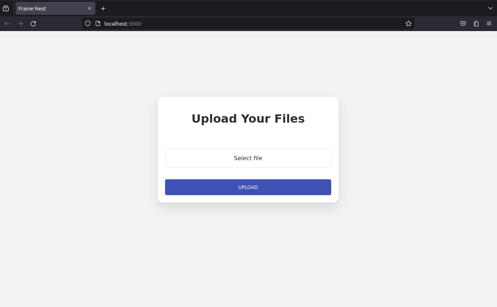

# FrameNest

**FrameNest** is a tool that uses computer vision to archive, and create searchable image databases with descriptive metadata.
The type of database it builds streamlines the training process of AI models in sectors such as advanced image recognition.



&nbsp;

## Prerequisites
Make sure you have [Node.js](https://nodejs.org/en/) and [Mongo Database](https://www.mongodb.com/) installed and running on your Mac or Linux.
> Additionally, you could also install [MongoDB Compass](https://www.mongodb.com/products/compass) to view the database, it's basically a GUI for MongoDB. *( although not required if you're comfortable with the command line )*
#### Make sure you have the following installed:
- Mongodb cli: [donwlod here](https://www.mongodb.com/try/download/community)
- Mongo tools: [download here](https://www.mongodb.com/try/download/database-tools)
- Mongo compass: [download here](https://www.mongodb.com/try/download/compass)

Last but not least, you need an [Astica](https://astica.io/) account to use the computer vision API.

&nbsp;

## Installation

2. Go to the root directory of the project and create a `.env` file with the following content and replace the values with your own:
```
ASTICA_KEY=< replace this with your astica computer vision key >
DB_CONNECTION_STRING=< replace this with your mongodb connection string >
```
3. Install the dependencies:
```bash
npm install && npm fund
```

4. Lastly, make `db_upload.sh` and `start.sh` executable:
```bash
chmod +x db_upload.sh start.sh
```

&nbsp;

## Usage of the webapp

1. Run the following command in the root directory of the project:
```bash
./start.sh
```

2. Open your browser and go to 
```
http://localhost:3000/
```

&nbsp;

## OS specific instructions
This installation guide is for Mac and Linux users.

&nbsp;

## TODO
- [ ] Add Windows installation guide
- [ ] Add code documentation